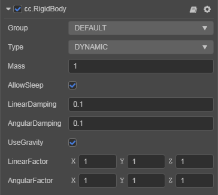

# 刚体组件

刚体是组成物理世界的基本对象，可以让一个节点受到物理影响并产生反应。在使用 Builtin 物理引擎时刚体组件无效。



点击 **属性检查器** 下方的 **添加组件 -> Physics -> RigidBody**，即可添加刚体组件到节点上。

## 刚体属性

| 属性             | 功能说明                             |
| :-------------- | :----------                         |
| Type            | 刚体类型，目前包括 **DYNAMIC**、**STATIC** 和 **KINEMATIC**，详情可查看下方介绍。
| Mass            | 刚体的质量                            |
| AllowSleep      | 是否允许刚体进入休眠状态   |
| Linear Damping  | 线性阻尼，用于减小刚体的线性速率，值越大物体移动越慢        |
| Angular Damping | 角阻尼，用于减小刚体的旋转速率，值越大刚体旋转越慢          |
| Use Gravity     | 如果开启，刚体会受到重力影响             |
| Linear Factor   | 线性因子，可影响刚体在每个轴向的线性速度变化，值越大刚体移动越快 |
| Angular Factor  | 旋转因子，可影响刚体在每个轴向的旋转速度变化，值越大刚体旋转越快 |

刚体的 API 接口请参考 [Class RigidBody](https://docs.cocos.com/creator3d/api/zh/classes/physics.rigidbody.html)。

### 获取刚体组件

```ts
// TypeScript
const rigidBody = this.getComponent(RigidBody);
```

## 刚体类型

目前刚体类型包括 **STATIC**、**DYNAMIC** 和 **KINEMATIC** 三种。

- **STATIC**：静态刚体，`Mass = 0` 或者只有碰撞组件的物理元素。例如可用于质量巨大无比的石头。
- **DYNAMIC**：动力学刚体，`Mass > 0` 且 `isKinematic = false`。可以 **受到力的作用**。
- **KINEMATIC**：运动学刚体，`Mass > 0` 且 `isKinematic = true`。由开发者来控制刚体的位移和旋转，而不是受物理引擎的影响。

## 刚体质心

目前质心固定在刚体组件绑定的节点上，质心和碰撞体是相对关系。通过调整形状的偏移 `center`，可以使质心在形状上进行偏移。


> **注意**：为了使碰撞体更方便的贴合模型，未来可能会增加改变质心的方法，以及动态计算质心的机制。

## 休眠和唤醒

### 休眠刚体

休眠刚体时，会将刚体所有的力和速度清空，使刚体停下来。

```ts
// 休眠
if (rigidBody.isAwake) {
    rigidBody.sleep();
}
```

### 唤醒刚体

```ts
// 唤醒
if (rigidBody.isSleeping) {
    rigidBody.wakeUp();
}
```

## 让刚体运动起来

让刚体运动，需要改变刚体的速度，目前改变刚体的速度有以下几种方式：

### 通过重力

刚体组件提供了 `useGravity` 属性，将 `useGravity` 属性设置为 `true`。

### 通过施加力

刚体组件提供了 `applyForce` 接口，签名为：

`applyForce (force: Vec3, relativePoint?: Vec3)`

根据牛顿第二定律 **F = m * a**，对刚体的某个点施加力会产生加速度，随着时间变化，速度会随加速度变化，就会使得刚体运动起来。

```ts
rigidBody.applyForce(new Vec3(200, 0, 0));
```

### 通过扭矩

力与冲量也可以只对旋转轴产生影响，使刚体发生转动，这样的力叫做扭矩。刚体组件提供了 `applyTorque` 接口，签名为：

`applyTorque (torque: Vec3)`

通过此接口可以施加扭矩到刚体上，因为只影响旋转轴，所以不需要指定作用点。

### 通过施加冲量

刚体组件提供了 `applyImpulse` 接口，签名为：

`applyImpulse (impulse: Vec3, relativePoint?: Vec3)`

根据动量守恒的方程式 `F * Δt = m * Δv`，对刚体的某个点施加冲量，速度就会产生变化，刚体就会运动起来。

```ts
rigidBody.applyImpulse(new Vec3(5, 0, 0));
```

### 通过改变速度

- 线性速度

  刚体组件提供了 `setLinearVelocity` 接口，可用于改变线性速度，签名为：
  
  `setLinearVelocity (value: Vec3)`
  
  示例：

  ```ts
  rigidBody.setLinearVelocity(new Vec3(5, 0, 0));
  ```

- 旋转速度

  刚体组件提供了 `setAngularVelocity` 接口，可用于改变旋转速度，签名为：
  
  `setAngularVelocity (value: Vec3)`

  示例：

  ```ts
  rigidBody.setAngularVelocity(new Vec3(5, 0, 0));
  ```

## 限制刚体的运动

### 通过休眠

休眠刚体时，会将刚体所有的力和速度清空，使刚体停下来。

> **注意**：目前施加力、冲量、改变速度、分组和掩码会重新唤醒刚体。

### 通过阻尼

刚体组件提供了 `linearDamping` 和 `angularDamping` 属性：

- `linearDamping` 属性用于设置线性阻尼。

- `angularDamping` 属性用于设置旋转阻尼。

阻尼参数的范围可以在 0 到无穷之间，0 意味着没有阻尼，无穷意味着满阻尼。一般情况下阻尼的值是在 0 ～ 0.1 之间。

### 通过固定旋转

刚体组件提供了 `fixedRotation` 属性，默认为 `false`。设置 `fixedRotation = true` 可以固定刚体，使其不会产生旋转。

### 通过因子

刚体组件提供了 `linearFactor` 和 `angularFactor` 属性:

- `linearFactor` 属性用于设置线性因子。
- `angularFactor` 属性用于设置旋转因子。

因子是 `Vec3` 的类型，相应分量的数值用于缩放相应轴向的速度变化，默认值都为 **1**，表示缩放为 **1** 倍，即无缩放。

**注意**：
1. 将因子某分量值设置为 **0**，可以固定某个轴向的移动或旋转，如果要完全固定旋转，请用 `fixedRotation`。
2. 在物理引擎 `cannon,js` 和 `ammo.js` 中，因子作用的物理量不同，在 `cannon` 中是作用于速度，在 `ammo` 中则是作用于力。
