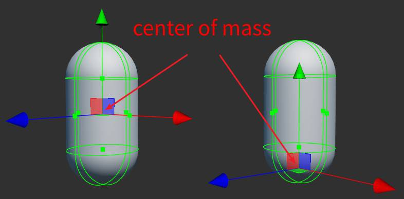

# 刚体组件

## 获取刚体组件

`TypeScript`的代码示例：`const rigidBody = this.getComponent(RigidBodyComponent);`

## 刚体类型

刚体一般分为三种类型，`static`,`dynamic`,`kinematic`.

- **static**，表示静态刚体，犹如质量巨大无比的石头，具体为质量为`0`的，或者只有碰撞组件的物理元素。
- **dynamic**，表示动力学刚体，能够**受到力的作用**，具体为质量大于`0`并且`isKinematic`为`false`的。
- **kinematic**，表示运动学刚体，由用户来控制该刚体的运动，具体为质量大于`0`并且`isKinematic`为`true`的。

## 刚体质心

目前质心固定在刚体组件绑定的节点上，质心和碰撞体是相对关系。通过调整形状的偏移`center`，可以使质心在形状上进行偏移。



**注：为了使碰撞体更方便的贴合模型，未来可能会增加改变质心的方法，以及动态计算质心的机制**。

## 休眠和唤醒

代码示例：

```ts
if (rigidBody.isAwake) {
  rigidBody.sleep();
}
if (rigidBody.isSleeping) {
  rigidBody.wakeUp();
}
```

## 让刚体运动起来

让刚体运动，需要改变刚体的速度，目前改变刚体的速度有以下几种方式：

### 通过重力

刚体组件提供了`useGravity`属性，设置为`true`将受到重力的作用。

### 通过施加力

刚体组件提供了`applyForce`接口，签名为：`applyForce (force: Vec3, relativePoint?: Vec3)`。
根据牛顿第二定律`F = m * a`，对刚体某点上施加力，这样就有了加速度，随着时间变化，速度会随加速度变化，就会使得刚体运动起来。

代码示例：`rigidBody.applyForce(new Vec3(200, 0, 0));`

### 通过施加扭转力

刚体组件提供了`applyTorque`接口，签名为：`applyTorque (torque: Vec3)`。
通过此接口可以施加扭矩到刚体上，因为只影响旋转轴，所以不再需要指定作用点。

### 通过施加冲量

刚体组件提供了`applyImpulse`接口，签名为：`applyImpulse (impulse: Vec3, relativePoint?: Vec3)`。
根据动量守恒的方程式 `F * Δt = m * Δv`，对刚体某点施加冲量，由于物体的质量是恒定的，速度就会立马变化，刚体就会运动起来。

代码示例：`rigidBody.applyImpulse(new Vec3(5, 0, 0));`

### 通过直接改变速度

- 线性速度
  刚体组件提供了`setLinearVelocity`接口，可用于改变线性速度，签名为：`setLinearVelocity (value: Vec3)`。
- 旋转速度
  刚体组件提供了`setAngularVelocity`接口，可用于改变旋转速度，签名为：`setAngularVelocity (value: Vec3)`。

代码示例：

```ts
rigidBody.setLinearVelocity(new Vec3(5, 0, 0));
rigidBody.setAngularVelocity(new Vec3(5, 0, 0));
```

## 限制刚体的运动

## 通过休眠

休眠刚体时，会将刚体所有的力和速度清空，这将使刚体停下来。

**注：执行部分接口，例如施加力或冲量、改变速度、分组和掩码会唤醒刚体**。

## 通过阻尼

刚体组件提供了`linearDamping`和`angularDamping`属性，分别用于设置线性和旋转的阻尼。
阻尼参数的范围可以在`0`到无穷之间，`0`意味着没有阻尼，无穷意味着满阻尼。

## 通过固定旋转

刚体组件提供了`fixedRotation`属性，默认为`false`，设置为`true`可以用于固定刚体，使其不会产生旋转。

## 通过因子

刚体组件提供了`linearFactor`和`angularFactor`属性，分别用于设置线性和旋转的因子。
因子是`Vec3`的类型，相应分量的数值用于缩放相应轴向的速度变化，默认值都为`1`，代表着缩放为`1`倍，即无影响。

**注：将因子某分量值设置为`0`，可以固定某个轴向的移动或旋转，如果要完全固定旋转，请用 `fixedRotation`**。
**注：在`cannon`、`ammo`后端中，因子作用的物理量不同，`cannon`中作用于速度，`ammo`中作用于力**。

---

继续前往 [物理事件](physics-event.md) 说明文档。
