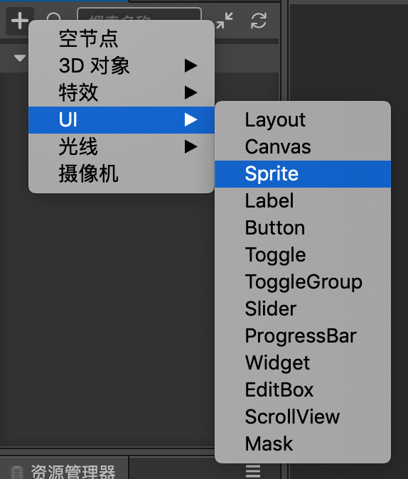

# UI 结构说明

UI 渲染采用树状结构，**Canvas** 节点（带有 Canvas 组件的节点）是 UI 的根节点，所有 UI 节点必须在 Canvas 节点下才可以被渲染。每一个 UI 节点必须带有 `UITransform` 组件作为点击或者对齐策略等功能生效的必要条件。

UI 支持 2D & 3D 相机混合排序的方式。通过切换渲染模式，调节组件上的 `priority` 属性来控制排序。

UI 还支持对模型进行渲染，唯一的条件是带有模型组件（例如 `MeshRenderer` / `SkinnedMeshRenderer`）的节点必须添加 **UI / Model** 组件才可以和 UI 在相同的管线上进行渲染。

UI 渲染流程如下：

## UI 入门

UI 是游戏开发的必要交互部分，一般游戏上的按钮、文字、背景等都是通过 UI 来制作的。在开始制作一款 UI 时，首先需要确定当前设计的内容显示区域大小（设计分辨率），可以在菜单栏的 **项目 -> 项目设置 -> 通用设置** 面板中设置：

设计分辨率设置完成后，开始创建 UI 元素，所有的 UI 元素都包含在 Canvas 节点下。可以在 **层级管理器** 面板中点击左上方的 **+** 按钮，然后选择 **UI -> Canvas** 来创建 Canvas 节点。Canvas 节点上有一个 [Canvas](../editor/canvas.md) 组件，该组件内部会自动创建一个 camera。开发者可以通过调整 `Canvas` 上的 `RenderMode` 属性来实现真正意义上的 3D 相机与 2D 相机的穿插渲染。还可以通过 `Canvas/Camera` 组件上的 `priority` 参数来调整多个相机之间的显示优先级。

> **注意**：在一个场景中可以存在多个 Canvas 节点，但是 Canvas 节点不应该嵌套在另一个 Canvas 节点或其子节点下。

接下来就可以在 Canvas 节点下创建 UI 节点了。编辑器自带的 UI 节点有以下几种：

可以通过选中节点，在 **属性检查器** 面板中点击 **添加组件** 来查看 UI 组件。**UI -> Render** 中的组件属于 UI 渲染组件，其余都是 UI 功能组件。

UI 渲染组件的先后顺序采用的是广度排序方案，也就是 Canvas 节点下的子节点的排序就已经决定了之后的整个 [渲染排序](priority.md)，不过可以通过渲染组件上的 `priority` 属性修改渲染排序。而对于没有渲染组件的节点，可以通过在 **属性检查器** 中选择 **添加组件 -> UI -> Reorder** 来添加一个只带有排序功能的组件来排序。

在一般的游戏开发中，必要的 UI 元素一般是 Sprite（精灵图）、Label（文字）、Mask（遮罩）、Layout（布局）、Widget（对齐）等。其中 Sprite 和 Label 用于渲染图片和文字。Mask 主要用于限制显示内容，比较常用的地方是一些聊天框和背包等。Layout 主要用于排版，一般用于按钮单一排列，背包内道具整齐排列等。最后一个比较重要的功能其实是 Widget，主要用于显示对齐。这里可能涉及到另外一个功能，那就是多分辨率适配，在我们设计完 UI 需要发布到不同平台时，势必会出现平台的实际设备分辨率和我们的设计分辨率不符的情况，这个时候为了适配不得不做一些取舍，比如头像框，是不能做缩放的，但是我们又希望它没有很大程度受设备影响，那么我们则需要为它添加上 Widget 组件，并且始终保证它对齐在我们的设计分辨率的左上方，具体参考：[对齐策略](widget-align.md) 和 [对齐](../editor/widget.md)。

当我们的界面制作完成之后，可能有人会发现，怎么发布 iPhone7 和 iPhoneX 的显示效果不一样？这个其实也是我们上面提到的设备分辨率的问题。在你以设计分辨率设计，最终以设备分辨率发布的时候，因为不同型号的手机设备分辨率可能不一致，这中间存在像素偏差的问题，因此，还需要做的一道转换工序那就是屏幕适配。在菜单栏的 **项目 -> 项目设置 -> 通用设置 -> 默认 Canvas 设置** 页面中可以看到，还有两个选项是 **适配屏幕宽度 / 适配屏幕高度**，按照 Cocos Creator 3D 提供的屏幕适配规则再结合 Widget 组件，就可以实现不同设备的轻松适配。具体适配说明可参考 [多分辨率适配方案](multi-resolution.md)。

## UI 规则介绍

- [渲染排序规则](priority.md)
- [UI 合批规则说明](ui-batch.md)
- [多分辨率适配方案](multi-resolution.md)
- [对齐策略](widget-align.md)
- [文字排版](label-layout.md)
- [自动布局容器](auto-layout.md)
- [制作动态生成内容的列表](list-with-data.md)
- [制作可任意拉伸的 UI 图像](sliced-sprite.md)
- [UI 材质说明](ui-material.md)
