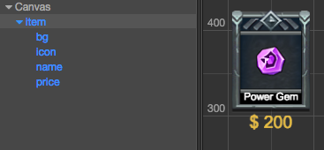
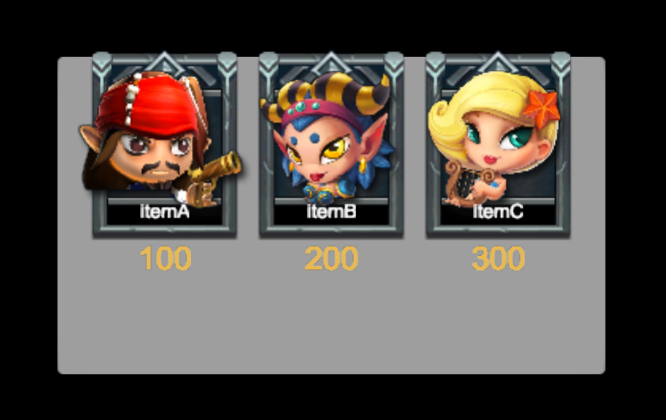

# 制作动态生成内容的列表

UI 界面只有静态页面内容是不够的，我们会遇到很多需要由一组数据动态生成多个元素组成的 UI 面板，比如选人界面、物品栏、选择关卡等等。

## 准备数据

以物品栏为例，我们要动态生成一个物品，大概需要这样的一组数据：

- 物品 id
- 图标 id，我们可以在另一张资源表中建立图标 id 到对应 spriteFrame 的索引
- 物品名称
- 出售价格
- ...

下面我们将会结合脚本介绍如何定义和使用数据，如果您对 Cocos Creator 3D 的脚本系统还不熟悉，可以先从 [脚本开发指南](../../../scripting/index.md)一章开始学习。

### 自定义数据类

对于大多数游戏来说，这些数据通常都来自于服务器或本地的数据库，现在我们为了展示流程，暂时把数据存在列表组件里就可以了。您可以新建一个脚本 `ItemList.js`，并添加如下的属性：

```ts
@ccclass('Item')
export class Item {
    @property
    id = 0;
    @property
    itemName = '';
    @property
    itemPrice = 0;
    @property(SpriteFrame)
    iconSF: SpriteFrame | null = null;
}

@ccclass
export class ItemList extends Component {
    @property([Item])
    items: Item[] = [];
    @property(Prefab)
    itemPrefab: Prefab | null = null;

    onLoad() {
        for (var i = 0; i < this.items.length; ++i) {
            var item = instantiate(this.itemPrefab);
            var data = this.items[i];
            this.node.addChild(item);
            item.getComponent('ItemTemplate').init(data);
        }
    }
}
```

上面脚本的前半部分我们声明了一个叫做 `Item` 的数据类，用来存放我们展示物品需要的各种数据。注意这个类并没有继承 `Component`，因此他不是一个组件，但可以被组件使用。关于声明自定义类的更多内容，请查阅[自定义 Class](../scripting/class.md)文档。

下半部分是正常的组件声明方式，这个组件中只有一个 `items` 属性，上面的声明方式将会给我们一个由 `Item` 类组成的数组，我们可以在 **属性检查器** 中为每个 `Item` 元素设置数据。

新建一个节点并将 `ItemList.js` 添加上去，我们可以在 **属性检查器** 里找到 `Items` 属性，要开始创建数据，需要先将数组的容量设为大于 0 的值。让我们将容量设为 3，并将每个元素的数据如下图设置。


这样我们最基本的数据就准备好了，如果您在制作有很多内容的游戏，请务必使用 excel、数据库等更专业的系统来管理您的数据，将外部数据格式转化为 Cocos Creator 可以使用的 JavaScript 和 JSON 格式都非常容易。


## 制作表现：Prefab 模板

接下来我们还需要一个可以在运行时用来实例化每个物品的模板资源 —— Prefab 预制。这个 Prefab 的结构如下图所示



`icon`, `name`, `price` 节点之后就会用来展示图标、物品名称和价格的数据。

### 模板组件绑定

您在拼装 Prefab 时可以根据自己的需要自由发挥，上图中展示的仅仅是一个结构的例子。有了物品的模板结构，接下来我们需要一个组件脚本来完成节点结构的绑定。新建一个 `ItemTemplate.js` 的脚本，并将其添加到刚才制作的模板节点上。该脚本内容如下：

```ts
@ccclass
export class ItemTemplate extends Component {
    @property
    public id = 0;
    @property(SpriteComponent)
    public icon: SpriteComponent | null = null;
    @property(LabelComponent)
    public itemName: LabelComponent | null = null;
    @property(LabelComponent)
    public itemPrice: LabelComponent | null = null;
}
```

接下来将对应的节点拖拽到该组件的各个属性上：


注意 `id` 这个属性我们会直接通过数据赋值，不需要绑定节点。

### 通过数据更新模板表现

接下来我们需要继续修改 `ItemTemplate.js`，为其添加接受数据后进行处理的逻辑。在上述脚本后面加入以下内容：

```ts
    // data: { id, iconSF, itemName, itemPrice }
    init(data: Item) {
        this.id = data.id;
        this.icon.spriteFrame = data.iconSF;
        this.itemName.string = data.itemName;
        this.itemPrice.string = data.itemPrice;
    }
```

`init` 方法接受一个数据对象，并使用这个对象里的数据更新各个负责表现组件的相应属性。现在我们可以将`Item` 节点保存成一个 Prefab 了，这就是我们物品的模板。

## 根据数据生成列表内容

现在让我们回到 `ItemList.js` 脚本，接下来要添加的是物品模板 Prefab 的引用，以及动态生成列表的逻辑。

```ts
    //...
    @property(Prefab)
    itemPrefab: Prefab | null = null;

    onLoad () {
        for (var i = 0; i < this.items.length; ++i) {
            var item = instantiate(this.itemPrefab);
            var data = this.items[i];
            this.node.addChild(item);
            item.getComponent('ItemTemplate').init(data);
        }
    }
```

在 `onLoad` 回调方法里，我们依次遍历 `items` 里存储的每个数据，以 `itemPrefab` 为模板生成新节点并添加到 `ItemList.js` 所在节点上。之后调用 `ItemTemplate.js` 里的 `init` 方法，更新每个节点的表现。

现在我们可以为 `ItemList.js` 所在的节点添加一个 **Layout** 组件，通过 **属性检查器** 下方的 `添加组件/添加 UI 组件/Layout`，然后设置 **Layout** 组件的以下属性：

- `Type`: `HORIZONTAL`
- `Resize Mode`: `CONTAINER`

别忘了把 `item` Prefab 拖拽到 `ItemList` 组件的 `itemPrefab` 属性里。您还可以为这个节点添加一个 **Sprite** 组件，作为列表的背景。

完成后的 `itemList` 节点属性如下：


## 预览效果

最后运行预览，可以看到类似这样的效果（具体效果和您制作的物品模板，以及输入的数据有关）：



注意前面步骤中添加 **Layout** 组件并不是必须的，**Layout** 能够帮助您自动排列列表中的节点元素，但您也可以用脚本程序来控制节点的排列。我们通常还会配合 **ScrollView** 滚动视图组件一起使用，以便在有限的空间内展示大量内容。可以配合[自动布局](auto-layout.md)和[滚动视图](../editor/scrollview.md)一起学习。

---

#### [UI 结构介绍](index.md)
